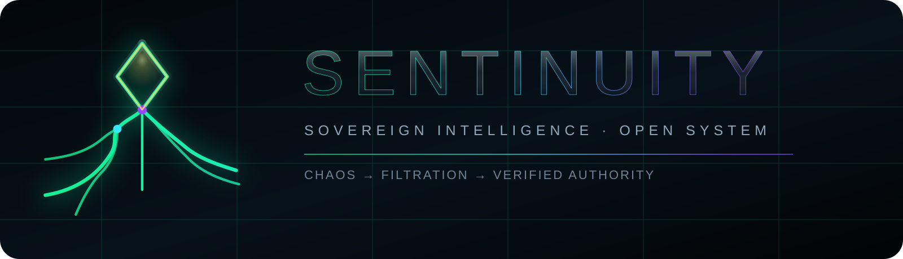

<p align="center"></p>

# Sentinuity

Sentinuity is an experimental sovereign-intelligence and trading-research framework for studying signal intake, price truth, paper execution, runner behaviour, smart-wallet observations, council-assisted research and multi-chain substrate workflows.

> **Current public safety posture:** paper and research modes first. Live-money operation is not represented as production-ready, profitable, risk-free or suitable for unattended deployment.

## Why this repository exists

The project is being opened so developers, researchers and designers can inspect the architecture, reproduce findings, improve reliability and build new modules on top of the framework. Contributions should preserve the core hierarchy:

**command truth → blockers → trade truth → gates → execution flow → post-exit evidence → council → copytrade → world state → diagnostics**

## Current signed-off release

This candidate retains the latest runner-aware oracle and executor behaviour while adding bounded SQLite-contention handling to the Forge intelligence orchestrator, macro channel and ingestion pipeline. The crystalline Sentinuity identity is integrated into the sovereign interface without removing matrix rain or changing trading authority.

See [`RELEASE_NOTES.md`](RELEASE_NOTES.md) and [`docs/RUNTIME_SAFETY.md`](docs/RUNTIME_SAFETY.md).

## Repository map

| Path | Purpose |
|---|---|
| `core/` | Shared contracts, schema and identity primitives |
| `services/` | Price truth, execution, intelligence, council and runtime services |
| `ui/` | Sovereign interface modules and visual truth panels |
| `wallets/` | Substrate wallet abstractions, providers and risk guards |
| `launch/` | Operator launch, shutdown, preflight and maintenance tooling |
| `assets/brand/` | Official Sentinuity identity assets and source components |
| `docs/` | Architecture, setup and safety documentation |

## Start safely

1. Read [`docs/SETUP.md`](docs/SETUP.md).
2. Copy `.env.example` to `.env` and supply only your own credentials.
3. Run preflight verification.
4. Start in paper-only mode.
5. Review logs and database contention before considering any live configuration.

```powershell
python .\launch\preflight_verifier.py
cmd /c .\launch\Launch_Sentinuity_Public_Paper.bat
```

## Contributing

Read [`CONTRIBUTING.md`](CONTRIBUTING.md). Please open focused changes with evidence, tests and a clear statement of which runtime authority is affected.

## Licence status

A public open-source licence has **not yet been selected**. Until a licence is added, GitHub visitors may inspect the source but do not automatically receive open-source reuse rights. Select and add the intended licence before announcing the repository as open source.

## Disclaimer

This software is experimental and may lose money, fail, misprice assets, encounter third-party outages or contain defects. It is not financial advice. Never commit private keys, seed phrases, API secrets, databases or live logs.
